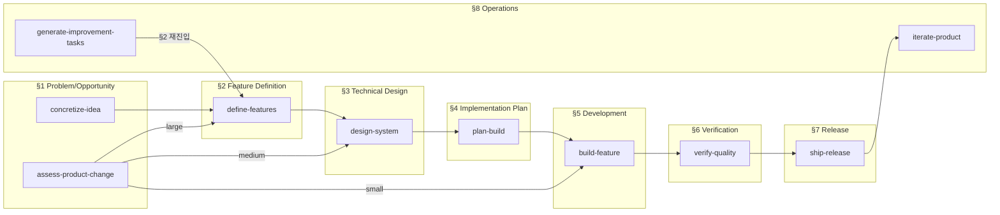
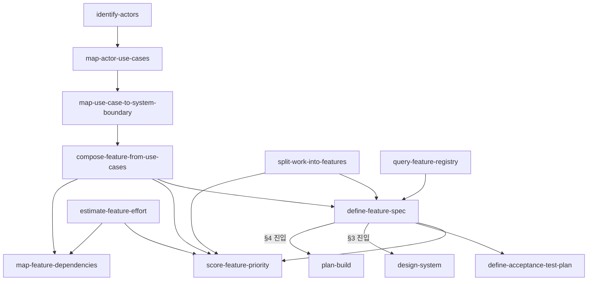
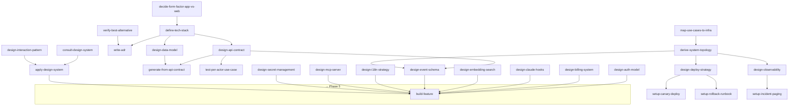
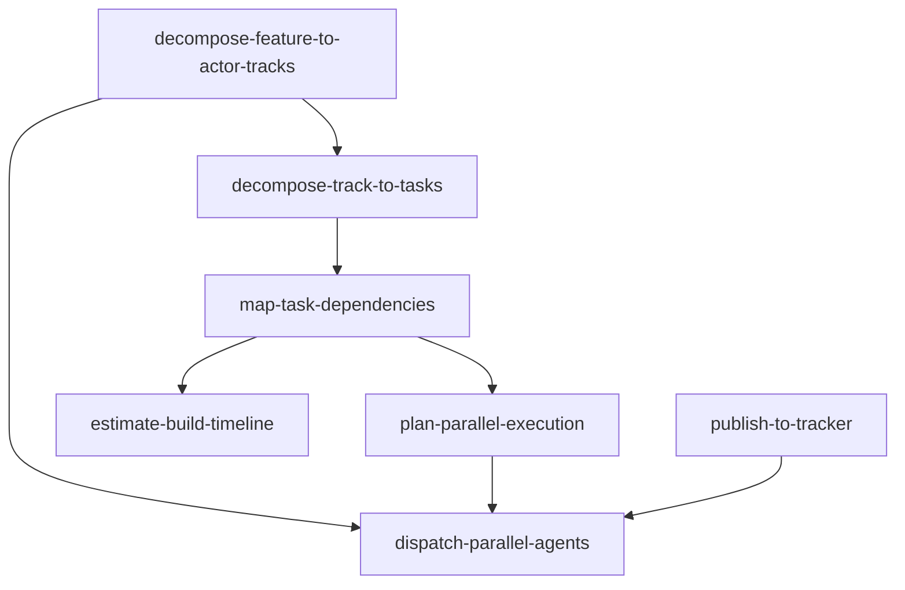
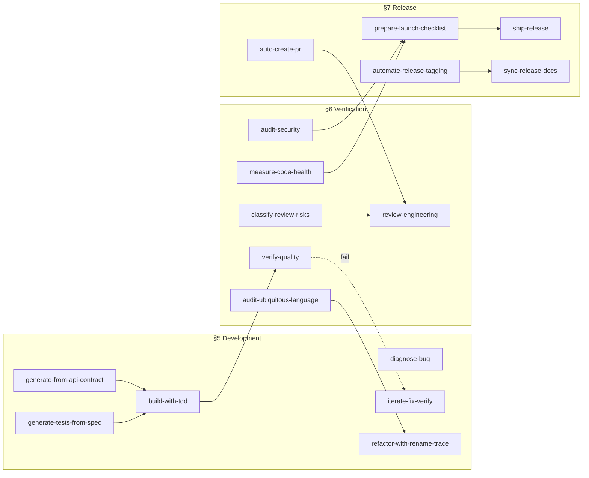
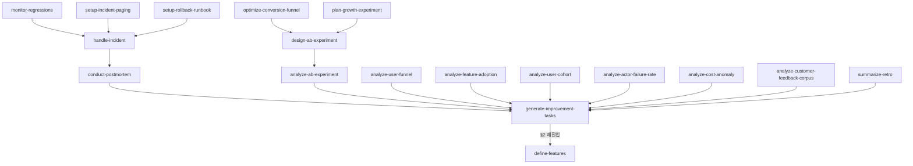

# Plugin Skills — 전이 그래프 (I/O Contract 기반)

> **자동 도출**: 각 스킬의 Output Contract Consumers를 따라가면 생성되는 연결 그래프.
> 총 **149 connections** across 153 skills.
>
> **기준 문서**: [`engineering-phases.md`](../plugin/skills/router/references/engineering-phases.md)

---

## §1. Phase 간 핵심 흐름 (Orchestrator 수준)

---

## §2. Phase 2 내부 cascade (Feature Definition)

---

## §3. Phase 3 내부 cascade (Technical Design)

---

## §4. Phase 4 내부 cascade (Implementation Planning)

---

## §5. Phase 5-6-7 cascade (Development → Verification → Release)

---

## §6. Phase 8 내부 cascade (Operations)

---

## §7. 연결 통계

| 항목 | 값 |
|------|---|
| 총 스킬 | 153 (PROCEDURE.md) |
| 총 I/O 연결 | 149 |
| Broken reference | 0 |
| Dead-end (output이 없는 비-leaf 스킬) | 0 |
| Cross-phase 연결 | 43 |
| Phase 내부 연결 | 106 |
