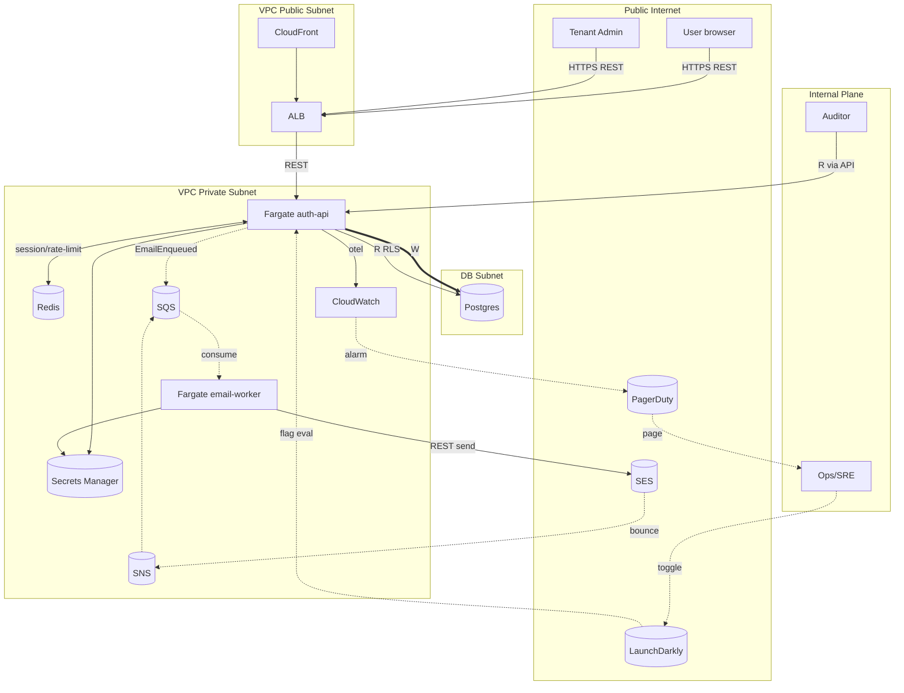

# derive-system-topology — actor 그래프 → 시스템 토폴로지 자동 도출

§3 Technical Design phase 의 cascade bridge stage. **Q8=(a) cascade 의 §2→§3 시각화 layer**. `map-use-cases-to-infra` 산출물 (actor × infra matrix + cross-actor shared) 을 입력으로 **시스템 토폴로지 다이어그램** (mermaid + JSON) 자동 도출. 산출물 = service map + data flow + trust boundary + traffic edge — design-system orchestrator 의 후속 stage (design-data-model / design-api-contract) 가 이 토폴로지 위에서 진행.

## 0. STOP — 시작 전 읽기

이 skill 은 다음 anti-pattern 들을 방지한다. 발견 시 §5 회귀:

- **Component 만 있고 edge 없음** — node list 만 출력 → 시스템 작동 흐름 불명. data flow + traffic edge 강제.
- **Trust boundary 부재** — public ↔ internal ↔ DB 경계 시각화 안 하면 attack surface 분석 불가.
- **Sync vs async 구분 모호** — REST API call 과 SQS event 가 같은 화살표로 표시 → §4 plan 단계에서 cross-actor edge 분류 무근거.
- **Single source of truth 부재** — mermaid 만 만들고 JSON 안 내면 후속 skill (design-data-model 등) 이 parsing 못 함.
- **trust boundary 위반 silent** — 외부 actor 가 internal DB 직접 접근 (anti-pattern) 발견 시 flag 안 함.
- **Topology 가 map-use-cases-to-infra 와 disconnect** — 본 skill 이 그 산출물 을 입력으로 받는데 actor list / shared infra 정합 안 되면 무근거.

§5 의 모든 phase 누락 없이 수행하라.

## 1. 목적

actor model + infra mapping 을 **graphical + machine-readable 토폴로지** 로 변환. 후속 design skill 이 이 토폴로지 위에서 자기 영역 (data / API / event / auth) 을 elaborate. 시각화 자체가 가치 — 사용자가 시스템 작동 흐름을 한 화면에 본다.

## 2. 사용 시점 (When to invoke)

- §3 design-system 진입 — `map-use-cases-to-infra` 직후 (chain 권장)
- 신규 actor / shared infra 추가 시 토폴로지 재생성
- 보안 review 진입 시 (trust boundary 분석 baseline)
- §4 decompose-feature-to-actor-tracks 진입 전 (cross-actor edge source)
- onboarding 신규 팀원 시 (시스템 한 화면 이해)

## 3. 입력 (Inputs)

### 필수
- `map-use-cases-to-infra` 산출물 — actor × use case × infra matrix + cross-actor shared
- §3 `define-tech-stack` ADR — selected infra component
- §3 `design-api-contract` 가 있다면 — sync API edge schema
- (해당 시) `design-event-schema` 산출물 — async event edge schema

### 선택
- 기존 토폴로지 다이어그램 (regression 비교)
- multi-region 결정 (region 별 토폴로지 split)
- compliance audit 요구 (trust boundary 명시 의무)

### 입력이 부족할 때 forcing question
- "map-use-cases-to-infra 가 완료됐나? actor / shared infra 정합 안 되면 본 skill 무근거."
- "sync vs async edge 구분이 명확한가? OpenAPI / SQS event schema 두 source 모두 입력으로 받았나?"
- "trust boundary 가 명시됐나? public internet / VPC public subnet / VPC private subnet / DB subnet — 4 layer 구분 의무."

## 4. 핵심 원칙 (Principles + Posture)

운영 posture:

- **입장 취함, hedge 금지** — edge type / trust boundary 단호. "어느정도 boundary" 거부.
- **사용자 입력을 challenge** — "topology 그려줘" 발화에 "actor / infra 매핑 input 있나?" push.
- **Specificity 강제** — generic "API call" 거부, "POST /v1/signup over HTTPS via ALB" 명시.
- **Both human + machine readable** — mermaid (human) + JSON (machine) 둘 다 산출.

도메인 원칙:

1. **Node = (actor | infra component)** — 두 type 분리 표시 (예: actor = sub-graph, infra = node).
2. **Edge type 분류 의무** — sync API / async event / DB write / DB read / cache R/W / admin/control plane / observability 7 type.
3. **Trust boundary 4 layer** — public internet / VPC public / VPC private / DB subnet (또는 RDS isolation).
4. **Bidirectional cross-check** — topology 가 map-use-cases-to-infra 의 모든 edge cover, 반대도.
5. **JSON schema 표준** — 후속 skill (design-data-model / design-api-contract) 이 parse 가능 schema (nodes + edges + metadata).

## 5. 단계 (Phases)

### Phase 1. Node enumeration

map-use-cases-to-infra 의 actor + infra component 모두 node 화:

| Node ID | Type | Name | Trust layer | Cluster |
|---------|------|------|-------------|---------|
| n1 | actor | User (end-user browser) | public | external |
| n2 | actor | Tenant Admin | public | external |
| n3 | actor | Ops/SRE | internal | control plane |
| n4 | actor | Auditor | internal | compliance |
| n5 | infra | CloudFront | public edge | edge |
| n6 | infra | ALB | VPC public | network |
| n7 | infra | Fargate ECS (auth-api) | VPC private | compute |
| n8 | infra | Fargate ECS (email-worker) | VPC private | compute |
| n9 | infra | Postgres 16 RDS | DB subnet | data |
| n10 | infra | Redis ElastiCache | VPC private | data |
| n11 | infra | SQS (email-out + bounce) | VPC private (managed) | queue |
| n12 | infra | SES | external SaaS | external |
| n13 | infra | SNS (bounce notification) | VPC private (managed) | queue |
| n14 | infra | CloudWatch + X-Ray | VPC private (managed) | observability |
| n15 | infra | LaunchDarkly | external SaaS | control plane |
| n16 | infra | PagerDuty | external SaaS | control plane |
| n17 | infra | Secrets Manager | VPC private (managed) | identity |

### Phase 2. Edge type 분류

7 edge type:

| Type | Symbol (mermaid) | Color | Example |
|------|------------------|-------|---------|
| sync API (HTTPS) | `-->|REST|` | blue | User → ALB → Fargate API |
| async event (queue) | `-.->|SQS|` | orange | Fargate API → SQS → email-worker |
| DB write | `==>|W|` | red | Fargate API → Postgres (W) |
| DB read | `-->|R|` | green | Fargate API → Postgres (R) |
| cache R/W | `<-->|cache|` | purple | Fargate API ↔ Redis |
| admin/control plane | `-..->|admin|` | gray dashed | Ops → LaunchDarkly toggle |
| observability | `-->|otel|` | dotted gray | Fargate → CloudWatch metrics |

### Phase 3. Edge enumeration (actor × infra matrix → edges)

매핑:

```
User (n1) -->|REST signup/login/etc| ALB (n6) -->|REST| Fargate (n7)
Fargate (n7) ==>|W users/sessions| Postgres (n9)
Fargate (n7) <-->|session/rate-limit| Redis (n10)
Fargate (n7) -.->|EmailEnqueued| SQS (n11)
SQS (n11) -.->|consume| email-worker (n8)
email-worker (n8) -->|REST send| SES (n12)
SES (n12) -.->|bounce notify| SNS (n13)
SNS (n13) -.->|push| SQS (n11) -.->|consume bounce| Fargate (n7) ==>|W users.email_verified=NULL| Postgres (n9)

Tenant Admin (n2) -->|REST admin/audit-log| ALB (n6) -->|REST| Fargate (n7)
Fargate (n7) -->|R RLS-scoped audit_log| Postgres (n9)

Ops/SRE (n3) -..->|toggle ops_*| LaunchDarkly (n15)
LaunchDarkly (n15) -..->|flag eval| Fargate (n7)
CloudWatch (n14) -..->|alarm| PagerDuty (n16) -..->|page| Ops/SRE (n3)
Fargate (n7) -->|otel traces+metrics| CloudWatch (n14)

Auditor (n4) -->|R audit_log time-range| Postgres (n9)

Fargate/email-worker (n7,n8) -->|R secret| Secrets Manager (n17)
```

총 ~22 edge.

### Phase 4. Trust boundary visualization

4 layer:

```
┌─────────────────────────────────────────────────────────────────┐
│ Public Internet                                                 │
│   User browser, Tenant Admin browser, External SaaS (SES, LD, PD) │
└────────────────────────────┬────────────────────────────────────┘
                             │ HTTPS (TLS termination at ALB)
┌────────────────────────────┴────────────────────────────────────┐
│ VPC Public Subnet                                               │
│   CloudFront edge, ALB                                          │
└────────────────────────────┬────────────────────────────────────┘
                             │ ALB → Fargate task IP
┌────────────────────────────┴────────────────────────────────────┐
│ VPC Private Subnet                                              │
│   Fargate ECS (auth-api, email-worker), ElastiCache Redis,      │
│   SQS / SNS (managed), CloudWatch, Secrets Manager              │
└────────────────────────────┬────────────────────────────────────┘
                             │ RDS endpoint, IAM-authenticated
┌────────────────────────────┴────────────────────────────────────┐
│ DB Subnet (RDS-only, isolated)                                  │
│   Postgres 16 RDS                                               │
└─────────────────────────────────────────────────────────────────┘
```

trust boundary 위반 검증:
- ✓ User → DB 직접 접근 0 (반드시 ALB → Fargate 경유)
- ✓ External SaaS 간 cross-talk 없음
- ✓ Auditor 의 audit_log 접근은 read-only API endpoint 경유 (직접 DB 접근 없음)

### Phase 5. mermaid + JSON 산출

**mermaid:**



**JSON (machine-readable):**

```json
{
  "version": "1.0",
  "metadata": {
    "project": "<project name>",
    "derived_from": "map-use-cases-to-infra",
    "trust_layers": ["public", "vpc-public", "vpc-private", "db-subnet"]
  },
  "nodes": [
    {"id": "n1", "type": "actor", "name": "User", "trust_layer": "public"},
    {"id": "n7", "type": "infra", "name": "Fargate-auth-api", "trust_layer": "vpc-private", "cluster": "compute"}
  ],
  "edges": [
    {"from": "n1", "to": "n6", "type": "sync-api", "protocol": "HTTPS", "label": "REST signup/login/etc"},
    {"from": "n7", "to": "n9", "type": "db-write", "tables": ["users", "sessions", "audit_log"]},
    {"from": "n7", "to": "n11", "type": "async-event", "schema": "EmailEnqueued"}
  ],
  "trust_boundary_violations": []
}
```

후속 skill 이 JSON parse 해서 자기 영역 추출 — 예: design-data-model 은 `db-write` / `db-read` edge 만 필터링, design-api-contract 는 `sync-api` edge.

## 6. 산출물 형식 (Output format)

> structured 출력 강제, prose 변환 금지.

```markdown
## derive-system-topology Output — <project name>

### Summary
<3 줄: total nodes / total edges / trust layer 분포 / boundary violation count>

### Node List
| Node ID | Type | Name | Trust layer | Cluster |
|---------|------|------|-------------|---------|
| ... | ... | ... | ... | ... |

### Edge List (by type)
| From | To | Type | Protocol / Schema |
|------|-----|------|---------------------|
| ... | ... | sync-api/async-event/db-write/db-read/cache/admin/observability | ... |

### Trust Boundary
| Layer | Nodes | Boundary crossing rules |
|-------|-------|--------------------------|
| public | ... | only via HTTPS to ALB |
| vpc-public | ... | TLS termination, forward to private |
| vpc-private | ... | DB endpoint via IAM auth |
| db-subnet | ... | RDS isolated |

### Boundary Violation Check
| # | Issue | Severity | Mitigation |
|---|-------|----------|------------|
| (none — 0 violations) | n/a | n/a | n/a |

### Mermaid Diagram
\`\`\`mermaid
<above mermaid graph TB ...>
\`\`\`

### JSON Schema (machine-readable)
\`\`\`json
<above JSON>
\`\`\`

### Cascade
- **§3 design-data-model**: db-write/db-read edges filter
- **§3 design-api-contract**: sync-api edges filter
- **§3 design-event-schema** (Cluster B): async-event edges filter
- **§4 decompose-feature-to-actor-tracks**: cross-cluster edges = cross-track contract
- **§6 audit-security**: trust boundary + violations 검토
- **§6 test-cross-actor-flow**: 모든 edge 가 cover 되는지 verification

### Next Step
<구체 action — 1줄: 예 "design-data-model 진입 — Postgres 9 entity 의 db-write/read pattern 시작">
```

## 7. Cross-phase cascade

- **§3 design-data-model / design-api-contract / design-event-schema**: 각자의 edge type filter
- **§4 decompose-feature-to-actor-tracks**: cross-cluster edge 가 cross-track contract source
- **§6 audit-security**: trust boundary + violation
- **§6 test-cross-actor-flow**: 모든 edge cover verify
- **§7 prepare-launch-checklist**: topology 자체가 readiness gate Engineering row evidence

## 8. 다음 skill (next in stage flow)

- `design-data-model` — db edges
- `design-api-contract` — sync-api edges
- `design-event-schema` (Cluster B candidate) — async-event edges
- `audit-security` (§6) — trust boundary + violation analysis

권장 chain (Q8=(a) cascade §3 핵심):
```
/buddy:chain define-tech-stack,map-use-cases-to-infra,derive-system-topology,design-data-model,design-api-contract,write-adr -- "<project>"
```

## 9. 다른 skill 과의 경계 (충돌 방지)

- **vs `map-use-cases-to-infra`** (§3) — 그것은 매핑 (intent), 본 skill 은 토폴로지 (structure visualization). 본 skill 이 후속.
- **vs `design-data-model` / `design-api-contract`** (§3) — 본 skill 은 cross-edge view (어떤 edge), 그들은 edge 의 detail (schema). 본 skill 이 먼저.
- **vs `audit-security`** (§6) — 본 skill 은 design 단계 trust boundary 정의, audit-security 는 implementation 단계 침투 검증. 본 skill 의 boundary 가 audit-security 의 baseline.
- **vs `decompose-feature-to-actor-tracks`** (§4) — 본 skill 은 §3 시각화, 그것은 §4 구현 분배. 본 skill 의 cross-cluster edge 가 cross-track contract 의 source.

## 10. 중요 규칙

- **Edge type 7 분류 의무** — single edge type 거부.
- **Trust boundary 4 layer 의무** — incomplete layer 거부.
- **Boundary violation check 의무** — 0 violation 확인 또는 명시적 mitigation.
- **mermaid + JSON 둘 다 산출** — single format 거부.
- **Bidirectional cross-check** — map-use-cases-to-infra 모든 edge cover.
- **Read-only on production** — 본 skill 은 시각화 산출, infra 변경 안 함.

## 11. Verification gate — 완료 선언 전 self-check

- [ ] §5 의 5 phase 누락 없이 실행
- [ ] §6 의 7 출력 섹션 (Summary / Node List / Edge List / Trust Boundary / Violation Check / Mermaid / JSON / Cascade) 모두 채워짐
- [ ] Node List 가 map-use-cases-to-infra 의 모든 actor + infra 포함
- [ ] Edge List 의 7 edge type 모두 cover (또는 미적용 시 명시)
- [ ] Trust Boundary 4 layer 모두 정의 + nodes 분포
- [ ] Boundary violation 0 확인 또는 mitigation 명시
- [ ] Mermaid 다이어그램 + JSON 둘 다 산출
- [ ] §4 posture 적용 — boundary 단호, hedge 없음
- [ ] §0 anti-pattern 부재 — node-only / boundary 부재 / sync-async 모호 / SSoT 부재 / violation silent / disconnect 모두 충족

하나라도 no 면 해당 phase 회귀 후 재검증.
