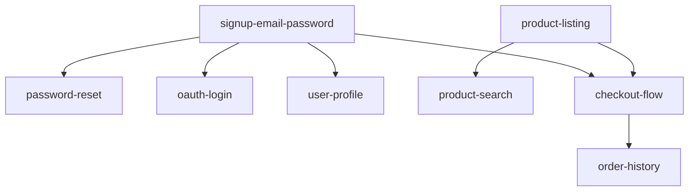

# map-feature-dependencies

feature 간 선후 의존성 그래프를 작성한다. §2 `define-features`의 여덟 번째 stage.

이 DAG가 §4 `plan-build`의 병렬 실행 계획 입력이 된다.

---

## 의존성 분류

| 유형 | 정의 | 예시 |
|------|------|------|
| **hard** | 선행 feature가 없으면 구현 불가 | OAuth login → 먼저 signup 필요 |
| **soft** | 선행 feature가 있으면 더 쉽게 구현 | dashboard → login 있으면 좋음 |
| **contract** | 공유 API / 데이터 모델에 의존 | feature-B가 feature-A의 API를 사용 |
| **parallel** | 의존성 없음, 동시 진행 가능 | signup과 product-listing은 독립 |

---

## 의존성 매핑 절차

### 1. Feature 목록 입력

`score-feature-priority` 출력의 feature 목록을 입력으로 받는다.

### 2. 의존성 식별

각 feature pair에 대해 의존성을 확인한다:

```yaml
dependencies:
  - feature: oauth-google-login
    depends_on:
      - feature_id: signup-email-password
        type: hard
        reason: "user model + JWT 발급 로직이 먼저 필요"
        
  - feature: user-profile
    depends_on:
      - feature_id: signup-email-password
        type: hard
        reason: "authenticated user session 필요"
        
  - feature: password-reset
    depends_on:
      - feature_id: signup-email-password
        type: hard
        reason: "user record + email 인프라 필요"
        
  - feature: product-listing
    depends_on: []  # 독립
    parallel_with:
      - feature_id: signup-email-password
        reason: "다른 actor track (catalog-service), 독립 구현 가능"
```

### 3. DAG 도식화

```
signup-email-password (Must, Sprint 1)
├── password-reset (Must, Sprint 1) [hard]
├── oauth-google-login (Should, Sprint 2) [hard]
└── user-profile (Could, Sprint 2) [hard]

product-listing (Must, Sprint 1) [parallel with signup]
└── product-search (Should, Sprint 2) [soft]

checkout-flow (Must, Sprint 2) [hard: depends on signup + product-listing]
```

### 4. Critical Path 식별

```
Critical path = 가장 긴 의존성 체인

예시:
signup-email-password (2주)
→ checkout-flow (3주) [depends on signup]
→ order-history (2주) [depends on checkout]

= 7주 (직렬)

vs.

product-listing + signup (병렬, 2주 동시)
→ checkout-flow (3주)
→ order-history (2주)

= 7주 총, 병렬로 2주 절약
```

### 5. 병렬 실행 그룹

```yaml
parallel_groups:
  - group: 1
    features: [signup-email-password, product-listing]
    note: "서로 다른 actor track (auth vs catalog)"
    
  - group: 2
    features: [password-reset, oauth-google-login]
    note: "signup 완료 후 병렬 가능"
    blocked_by_group: 1
    
  - group: 3
    features: [checkout-flow]
    blocked_by_group: [1, 2]  # signup + product-listing 모두 필요
```

---

## 출력 형식

```markdown
## Feature Dependency Graph

### 의존성 목록
| Feature | Depends On | Type | 이유 |
|---------|-----------|------|------|
| oauth-login | signup | hard | user model 필요 |
| password-reset | signup | hard | user record 필요 |

### DAG (Mermaid)


### 병렬 실행 그룹
- Group 1 (병렬): signup-email-password, product-listing
- Group 2 (Group 1 후 병렬): password-reset, oauth-login
- Group 3 (Group 1+2 후): checkout-flow

### Critical Path
signup → checkout-flow → order-history = 7주
병렬 최적화 시: 5주 (2주 절약)
```

---

## 다음 단계

→ `split-work-into-features` — 큰 feature 분리 (필요 시)
→ `triage-work-items` — backlog 상태 머신 진입
→ `plan-build` (§4) — feature dependency graph → actor track + task DAG 변환
