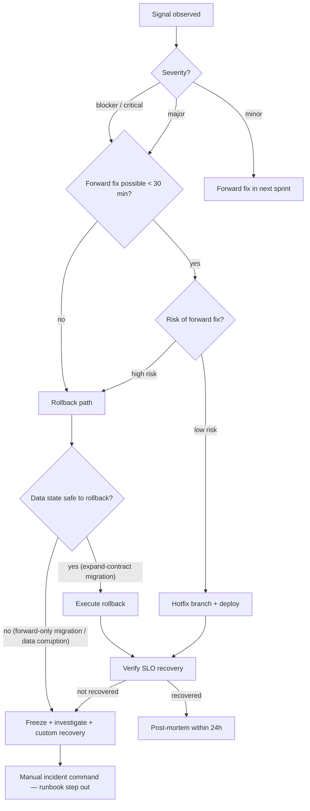

# setup-rollback-runbook — rollback decision tree + 실행 절차 + verification

§7 Release & Beta phase 의 stage. canary auto-rollback 이 1차 escape, 본 runbook 이 **complex case (data corruption, schema migration, multi-service hop)** 를 cover 하는 2차 escape. **decision tree (언제 rollback / 언제 forward fix), step-by-step 실행 (platform 별), verification protocol, data integrity 처리, post-rollback post-mortem trigger** 산출. incident 발생 시 의사결정 시간을 < 5 min 으로 압축하기 위해 사전 author.


## Input Requirements

| Input | Required | Type | Source | 미제공 시 |
|-------|----------|------|--------|----------|
| 배포 환경 맥락 | ✅ | knowledge | 사용자 도메인 지식 | "rollback 대상 환경과 서비스를 알려주세요." |

## Output Contract

| Output | Type | Format | Consumers |
|--------|------|--------|-----------|
| Rollback runbook (decision tree + 실행 절차 + verification) | artifact | structured document | `handle-incident` |

## 0. STOP — 시작 전 읽기

이 skill 은 다음 anti-pattern 들을 방지한다. 발견 시 §5 회귀:

- **"문제 생기면 rollback"** — vague. 어느 signal 이 rollback trigger 인가, forward fix 가능한 case 와 어떻게 구분?
- **Schema migration rollback 무시** — forward-only migration 에서 rollback 시 data loss / corruption. expand-contract 강제 필요.
- **Step-by-step 미작성** — runbook 이 "rollback the deploy" 한 줄이면 incident 시 oncall 이 뭐부터 할지 모름.
- **Verification 부재** — rollback 실행만 있고 health 회복 검증 없음 → rollback 자체가 새 incident 일 수 있음.
- **Platform 별 변형 무시** — Fargate / Lambda / k8s / DB / cache / CDN 각각 rollback procedure 다른데 generic 만 작성.
- **Post-mortem trigger 없음** — rollback = incident-grade event, 24h 내 post-mortem 없으면 learning 없이 동일 issue 재발.
- **Forward-fix 절대 금지** — 모든 issue 를 rollback 으로 처리 → small UX bug 도 full rollback. severity 기반 분기 필요.

§5 의 모든 phase 누락 없이 수행하라.

## 1. 목적

production incident 발생 시 의사결정 + 실행 시간 압축. canary auto-rollback 가 못 잡는 complex case (DB / cache / multi-service / cross-region) 의 manual procedure pre-author. oncall engineer 가 incident 중에 처음 보지 않게.

## 2. 사용 시점 (When to invoke)

- production deploy 직전 (default for new release)
- 신규 service launch 시 (필수)
- schema migration 포함 deploy (특히 forward-only migration)
- multi-service / multi-region deploy
- 신규 데이터 schema 변경 후
- post-incident review 의 "rollback 절차 부재" finding 후 보강

## 3. 입력 (Inputs)

### 필수
- §3 tech stack (hosting platform, DB, cache, queue, CDN)
- deploy strategy (canary / blue-green / rolling) — `setup-canary-deploy` 산출물
- schema migration 유무 + 패턴 (expand-contract / forward-only / 데이터 backfill 포함)
- observability stack (어느 signal 로 rollback trigger 판단)
- on-call rotation + escalation (`setup-incident-paging` 산출 또는 가정)

### 선택
- 이전 rollback 사례 (historical mean time to rollback, common failure mode)
- compliance 의무 (의료/금융 — rollback evidence 가 audit 산출물)
- multi-region 의 cross-region rollback 정책

### 입력이 부족할 때 forcing question
- "schema migration 이 forward-only 인가, expand-contract 인가? forward-only 면 rollback 자체가 data loss — design-data-model 에서 이미 expand-contract 강제됐어야 함."
- "rollback trigger signal 이 (a) error rate spike (b) p99 latency (c) business KPI (d) security alert 중 어느 것? 다중일 시 priority?"
- "rollback 의 data integrity check 가 명시됐나? rollback 후 data 가 일관 상태인지 검증 절차 없으면 rollback 자체가 corruption 원인."

## 4. 핵심 원칙 (Principles + Posture)

운영 posture:

- **입장 취함, hedge 금지** — decision tree 의 분기 단호. "상황에 따라" 거부, "error rate > 1% (5min) AND no forward fix possible (< 30 min) → rollback".
- **사용자 입력을 challenge** — "rollback 가능" 발화에 "schema migration 동시 rollback 인가? data state 어떻게 처리?" push.
- **Specificity 강제** — generic step "revert deploy" 거부, platform 별 actual command (예: `aws ecs update-service --service auth-api --task-definition auth-api:N-1`).
- **Forward fix bias for low-severity** — UX 사소 issue 는 hotfix 가 rollback 보다 빠름. severity tiering 강제.

도메인 원칙:

1. **Decision tree 의무** — signal → severity → forward vs rollback 분기 명시.
2. **Schema migration handling 의무** — expand-contract 강제 (이미 design-data-model 에서). 잘못된 forward-only 발견 시 rollback 자체 risk 명시.
3. **Step-by-step 의무** — generic 한 줄 거부. platform 별 actual command + verification step.
4. **Verification 의무** — rollback 실행 + SLO recovery 확인 + data integrity check.
5. **Post-mortem 자동 trigger** — rollback = incident-grade. 24h 내 conduct-postmortem 호출.
6. **Platform 별 변형 cover** — Fargate / Lambda / k8s / DB / cache / CDN / DNS 각각 procedure.

## 5. 단계 (Phases)

### Phase 1. Rollback trigger signal

| Signal | Threshold | Window | Action |
|--------|-----------|--------|--------|
| **Error rate (5xx)** | > 1% | 5 min sustained | rollback candidate |
| **p99 latency (critical endpoint)** | > SLO × 1.5 | 5 min sustained | rollback candidate |
| **p50 latency** | > baseline × 2 | 10 min sustained | rollback candidate |
| **Business KPI drop** | > 20% drop vs 7-day baseline | 30 min sustained | rollback candidate |
| **Security alert** | any (data exfiltration, unauth access pattern) | immediate | rollback OR kill switch |
| **Data corruption** | any (audit log RLS bypass, data inconsistency) | immediate | rollback + data integrity check |
| **Cascading failure** | 2+ downstream service degradation | immediate | rollback |
| **External feedback (UAT / beta / customer)** | confirmed reproducible critical | varies | triage → rollback or hotfix |

trigger source: alert (auto), oncall judgment (semi-auto), customer report (manual).

### Phase 2. Decision tree



decision SLA:
- detect → first action: ≤ 5 min
- decision (rollback vs hotfix): ≤ 10 min
- execute (rollback or hotfix deploy): ≤ 15 min from decision
- verify SLO recovery: ≤ 30 min from execute

### Phase 3. Step-by-step 실행 (platform 별)

본 SaaS auth example (cascade): Fargate + RDS + ElastiCache + SQS + CloudFront.

#### A. Application rollback (Fargate)

```bash
# pre-rollback
aws ecs describe-services --cluster auth-prod --services auth-api > pre-rollback-state.json
aws cloudwatch get-metric-statistics --namespace AWS/ECS --metric-name CPUUtilization \
  --dimensions Name=ClusterName,Value=auth-prod --start-time $(date -u -v-30M +%FT%TZ) \
  --end-time $(date -u +%FT%TZ) --period 60 --statistics Average > pre-rollback-cpu.json

# execute rollback (previous task definition revision)
PREV_REV=$(aws ecs describe-services --cluster auth-prod --services auth-api \
  --query 'services[0].deployments[0].taskDefinition' --output text \
  | awk -F: '{print $NF - 1}')
aws ecs update-service --cluster auth-prod --service auth-api \
  --task-definition auth-api:${PREV_REV} --force-new-deployment

# wait for rollback completion
aws ecs wait services-stable --cluster auth-prod --services auth-api --max-attempts 60

# verify
curl -fsS https://auth.example.com/healthz | jq .version
# expected: previous version
```

verification: healthcheck 200, error rate normalized within 5 min, p99 within SLO.

#### B. Database rollback (RDS Postgres)

case 1: schema migration was expand-contract:
- new column unused, no data loss → just revert app deploy (path A above)
- forward migration의 ADD COLUMN NULLABLE 은 backward-compat → rollback 후 column 보존, next deploy 에서 cleanup

case 2: schema migration was forward-only (anti-pattern, should not happen if design-data-model followed):
```bash
# DANGER — only if no other choice
aws rds restore-db-instance-to-point-in-time \
  --source-db-instance-identifier auth-prod \
  --target-db-instance-identifier auth-prod-rollback \
  --restore-time "2026-XX-XXTHH:MM:SSZ" \
  --db-instance-class db.r6g.large
# data loss between restore-time and now
```
이 path 는 RTO 30 min+, 명시적 incident command + customer notification 필수.

case 3: data corruption (RLS bypass, etc.):
```sql
-- freeze writes
SELECT pg_terminate_backend(pid) FROM pg_stat_activity 
  WHERE datname='auth_prod' AND state='active' AND pid <> pg_backend_pid();
-- analyze blast radius
SELECT count(*) FROM users WHERE created_at > '2026-XX-XX HH:MM:00';
-- restore selective via pg_dump from snapshot
```

#### C. Cache invalidation (Redis ElastiCache)

```bash
# kill switch via flag (if available — fastest)
launchdarkly toggle ops_session_cache_disable on

# manual flush (only if flag unavailable)
aws elasticache --redis-instance auth-redis --execute "FLUSHDB"
```
주의: cache flush 시 RDS load spike → graceful warm-up plan 필요.

#### D. CDN cache invalidation (CloudFront)

```bash
aws cloudfront create-invalidation --distribution-id E1XXXXXXXXX \
  --paths "/index.html" "/_next/static/*"
# wait 3-5 min for global propagation
```

#### E. DNS rollback (Route 53)

`Route 53 ALIAS` records 가 ALB 를 가리키므로 보통 rollback 불필요 (ALB 가 동일 task definition 으로 traffic). multi-region active-active 시:
```bash
# weighted routing 의 weight 0 으로
aws route53 change-resource-record-sets --hosted-zone-id Z123 --change-batch file://weight-0.json
# TTL ≤ 60s 로 사전 설정 필수 (DNS rollback 의 RTO 결정 인자)
```

#### F. Configuration rollback (Secrets Manager / Parameter Store)

```bash
aws secretsmanager update-secret-version-stage \
  --secret-id auth/jwt-key --version-stage AWSCURRENT \
  --move-to-version-id <previous-version-id>
```

### Phase 4. Schema migration handling

design-data-model 에서 이미 강제된 expand-contract pattern 이 본 phase 의 prerequisite. 본 skill 은 deploy-time enforcement:

| Migration pattern | Rollback feasibility | Procedure |
|-------------------|----------------------|-----------|
| Expand-contract (ADD column NULLABLE → backfill → DROP old) | full | app revert만, schema 그대로 두고 next release 에서 cleanup |
| Online index (CREATE INDEX CONCURRENTLY) | full | 그대로 두고 app revert만 |
| Forward-only column DROP (ANTI-PATTERN) | none | data loss 가능 — 미연 방지: PR review 시 reject |
| Forward-only data migration (UPDATE batch) | partial | reverse migration script 미리 author 의무 (idempotent) |
| Backfill running at deploy time | partial | backfill pause → revert app → cleanup partial backfill state |
| Partition addition (pg_partman) | full | partition 그대로 두고 app revert |
| Partition drop (retention job) | none | data loss 영구 — pre-deploy snapshot 필수 |

본 SaaS auth example: design-data-model 이 모든 migration 을 expand-contract 로 design 했으므로 case 1 / case 2 / case 6 만 발생. case 3 / case 7 은 PR review block.

### Phase 5. Verification + post-mortem trigger

post-rollback verification protocol:

| Check | Tool | Acceptance |
|-------|------|------------|
| SLO recovery | dashboard + alarm | error rate ≤ 0.1% (5 min sustained), p99 ≤ SLO (5 min sustained) |
| Healthcheck | `curl /healthz` | 200, version 이 previous deploy 와 일치 |
| Smoke test | k6 (5 hot endpoint) | 모두 green |
| Data integrity | pgTAP RLS test + audit_log row count vs expected | RLS green, audit row 일치 |
| Customer impact | error rate per tenant + support ticket inbound | 회복 후 신규 ticket 0 (5 min 내) |
| Downstream dep health | RDS conn / Redis / SQS depth | normal range |
| Log error pattern | CloudWatch Insights | new error code 0 (rollback 후 새 error 등장 안 함) |

post-mortem trigger:
- rollback 실행 = incident-grade event
- 24h 내 conduct-postmortem skill 자동 호출
- post-mortem doc 작성 + RCA + 재발 방지 action item
- 본 runbook 의 update trigger (gap 발견 시 보강)

incident communication:
- internal: #incidents Slack, status page (private), exec summary email
- external: status page (public) — within 15 min of rollback
- customer: 영향 받은 tenant 에 직접 notification (within 1h)

## 6. 산출물 형식 (Output format)

> structured 출력 강제, prose 변환 금지. 본 skill 은 runbook + decision tree 산출, 실제 commands 는 oncall 이 incident 시 참조.

```markdown
## setup-rollback-runbook Output — <project name> v<version>

### Summary
<3 줄: covered platforms / decision tree depth / schema migration safety status / mean rollback RTO>

### Trigger Signals
| Signal | Threshold | Window | Action tier |
|--------|-----------|--------|-------------|
| Error rate 5xx | > 1% | 5 min | rollback candidate |
| p99 latency | > SLO × 1.5 | 5 min | rollback candidate |
| ... | ... | ... | ... |

### Decision Tree
\`\`\`mermaid
graph TD
  S[Signal] --> A{Severity?}
  ...
\`\`\`

### Decision SLA
| Step | SLA |
|------|-----|
| Detect → first action | ≤ 5 min |
| Decision (rollback vs hotfix) | ≤ 10 min |
| Execute | ≤ 15 min from decision |
| Verify SLO recovery | ≤ 30 min from execute |

### Step-by-Step Procedures
| Component | Procedure | Tool / Command | RTO target |
|-----------|-----------|----------------|------------|
| App (Fargate) | Task definition revert | `aws ecs update-service --task-definition <prev>` | 5 min |
| RDS (expand-contract migration) | App revert only, schema 그대로 | `aws ecs update-service ...` | 5 min |
| RDS (data corruption, restore) | Point-in-time restore | `aws rds restore-db-instance-to-point-in-time` | 30+ min |
| Redis | Kill switch flag toggle (preferred) or FLUSHDB | LaunchDarkly toggle / `redis-cli FLUSHDB` | < 1 min |
| CloudFront | Invalidation | `aws cloudfront create-invalidation` | 3-5 min |
| Route 53 (multi-region) | Weight 0 to bad region | `aws route53 change-resource-record-sets` | DNS TTL + propagation |
| Secrets Manager | Version stage move | `aws secretsmanager update-secret-version-stage` | < 1 min |

### Schema Migration Safety Matrix
| Pattern | Rollback feasibility | Procedure | Pre-deploy review |
|---------|----------------------|-----------|-------------------|
| Expand-contract | full | app revert | OK |
| Online index | full | app revert | OK |
| Forward-only DROP column | **none** | n/a | **PR REJECT** |
| Forward-only data migration | partial | reverse script (must pre-author, idempotent) | review reverse script |
| ... | ... | ... | ... |

### Verification Protocol (post-rollback)
| Check | Tool | Acceptance |
|-------|------|------------|
| SLO recovery | dashboard + alarm | error ≤ 0.1%, p99 ≤ SLO (5 min sustained) |
| Healthcheck | curl /healthz | 200 + version = previous |
| Smoke test | k6 5 endpoint | all green |
| Data integrity | pgTAP RLS + audit row count | RLS green, count match |
| Customer impact | error rate per tenant | recovery, new ticket 0 in 5 min |
| Downstream health | RDS / Redis / SQS metrics | normal |
| Log pattern | CloudWatch Insights | no new error code |

### Post-Rollback Actions
| Action | Owner | Window |
|--------|-------|--------|
| #incidents Slack post (rollback executed) | on-call | immediate |
| Status page public update | release manager | 15 min |
| Customer notification (affected tenants) | success manager + on-call | 1 h |
| conduct-postmortem trigger | release manager | 24 h |
| Runbook update (if gap found) | platform | within post-mortem week |

### Cascade
- **§7 setup-canary-deploy**: canary auto-rollback 가 1차 escape, 본 runbook 이 2차 (complex case)
- **§7 setup-feature-flags**: kill switch flag 가 fast escape (< 1 min), schema rollback 보다 빠름
- **§7 setup-incident-paging**: rollback trigger signal 이 paging trigger 와 정합
- **§8 handle-incident**: rollback runbook 이 handle-incident 의 reference document
- **§8 conduct-postmortem**: rollback 실행 → 24h 내 자동 호출

### Next Step
<구체 action — 1줄: 예 "이 runbook 을 docs/runbooks/rollback-saas-auth.md 로 영속화 + on-call 교육 + 분기 1회 chaos drill 로 검증">
```

## 7. Cross-phase cascade

- **§7 setup-canary-deploy**: 1차 vs 2차 escape 정합
- **§7 setup-feature-flags**: kill switch fastest path
- **§7 setup-incident-paging**: rollback trigger ↔ paging trigger
- **§8 handle-incident**: 본 runbook = handle-incident reference
- **§8 conduct-postmortem**: rollback → 24h 자동 trigger

## 8. 다음 skill (next in stage flow)

- `setup-incident-paging` — paging routing 이 본 runbook 의 trigger 동작 보장
- `prepare-launch-checklist` — runbook 존재 여부가 readiness gate row

## 9. 다른 skill 과의 경계 (충돌 방지)

- **vs `setup-canary-deploy`** (§7) — canary auto-rollback 가 1차 (single service, traffic level), 본 runbook 이 2차 (multi-service, data state, schema, custom recovery).
- **vs `setup-feature-flags`** (§7) — kill switch 가 fastest (toggle off), 본 runbook 의 일부 (schema / data) 는 flag 로 cover 안 됨. 두 layer 정합 필요.
- **vs `handle-incident`** (§8) — handle-incident 는 incident 의 actual triage + execution, 본 skill 은 reference document (pre-author runbook). incident 시 oncall 이 본 runbook 참조해서 handle-incident 수행.
- **vs `conduct-postmortem`** (§8) — postmortem 은 post-rollback retrospective, 본 skill 은 pre-rollback preparation. 본 runbook 이 postmortem 의 input 의 일부 (어느 trigger 가 fire 했는지).
- **vs `automate-release-tagging`** (§7) — release tagging 은 forward, 본 skill 은 backward. 직접 conflict 없음.

## 10. 중요 규칙

- **Decision tree 의무** — vague "상황에 따라" 거부.
- **Schema migration safety 의무** — expand-contract 강제, forward-only column DROP / partition DROP 은 PR reject.
- **Step-by-step 의무** — generic 거부, platform 별 actual command.
- **Verification 의무** — rollback 실행만 있고 verify 없는 절차 거부.
- **Post-mortem 자동 trigger** — rollback = incident, 24h 내 conduct-postmortem.
- **RTO target 의무** — 각 component 별 RTO 명시 (mean rollback RTO 문서화).
- **Read-only on production code** — 본 skill 은 runbook 산출, 실제 자동화는 §5 build / SRE infra.

## 11. Verification gate — 완료 선언 전 self-check

- [ ] §5 의 5 phase 누락 없이 실행 (trigger → decision tree → step-by-step → schema handling → verification + post-mortem)
- [ ] §6 의 9 출력 섹션 (Summary / Trigger / Decision Tree / SLA / Step-by-Step / Schema Matrix / Verification / Post-Rollback Actions / Cascade) 모두 채워짐
- [ ] Trigger Signals ≥ 5 (error / latency / business / security / data corruption 포함)
- [ ] Decision Tree mermaid 명시, severity → forward vs rollback 분기 명확
- [ ] Decision SLA 4 step (detect / decide / execute / verify) 명시
- [ ] Step-by-Step Procedures 의 platform 별 변형 ≥ 5 component (App / DB / Cache / CDN / DNS / Secrets) 모두 cover, actual command 명시
- [ ] Schema Migration Safety Matrix ≥ 5 pattern, forward-only 류는 "PR REJECT" 명시
- [ ] Verification Protocol 7 check (SLO / healthcheck / smoke / data / customer / downstream / log) 모두 명시
- [ ] Post-Rollback Actions 의 5 step (Slack / status page / customer / postmortem / runbook update) 모두 명시
- [ ] §4 posture — decision 단호, "상황에 따라" hedge 없음
- [ ] §0 anti-pattern 부재 — vague trigger / schema 무시 / step 부재 / verify 없음 / platform 무시 / postmortem 없음 / forward-fix 무시 모두 충족

하나라도 no 면 해당 phase 회귀 후 재검증.
