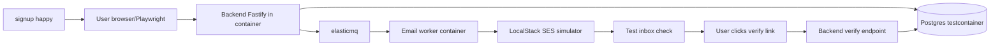

# test-cross-actor-flow — actor 협업 시나리오 E2E

§6 verify-quality phase 의 stage 3. **per-actor pass 후 (test-per-actor-use-case prerequisite)** multi-actor 협업 flow (signup → email → verify → login → me 같은 chain) 의 full-stack 검증. §4 task DAG 의 cross-actor edge 가 본 skill 의 coverage 의무 source. **Playwright + LocalStack + SES simulator + miniredis + testcontainers 모든 infra 동시 active** 상태에서 real component chain 통과 검증. 산출물은 flow × actor list × test status, integration evidence, cross-actor edge coverage matrix, contract drift detection.

## 0. STOP — 시작 전 읽기

이 skill 은 다음 anti-pattern 들을 방지한다. 발견 시 §5 회귀:

- **Per-actor 통과 없이 cross-actor 진입** — per-actor failure 가 cross-actor false positive 의심 원인. test-per-actor-use-case pass 강제 prerequisite.
- **Mock-only cross-actor test** — 한 actor 만 real, 나머지 mock → cross-actor 가 아니라 partial integration. 모든 actor real 또는 simulator (LocalStack / SES sandbox) 강제.
- **Cross-actor edge coverage gap silent** — DAG 의 edge 중 어느 flow 도 cover 안 하는 edge 존재 → integration risk. coverage matrix 강제.
- **Contract drift 무시** — Pact / Schemathesis / oasdiff 가 drift 발견했는데 cross-actor flow 만 보고 통과 → API contract 변경 silent merge.
- **Evidence 부재** — flow 통과 / 실패 의 video / log / screenshot 없으면 incident 시 reproduction 불가.
- **Flaky tolerance 없음** — cross-actor flow 의 flaky rate 측정 안 함 → release 후 production flake 가 본 test 의 flake 였는지 구분 불가.

§5 의 모든 phase 누락 없이 수행하라.

## 1. 목적

actor 협업 flow 가 실제 component chain 위에서 작동하는지 검증. per-actor unit/integration 만으로는 actor 간 contract drift / event ordering / data race 못 잡음. cross-actor flow E2E 가 그 gap 채움.

## 2. 사용 시점 (When to invoke)

- §6 verify-quality stage 3 (default, after stage 2)
- cross-actor contract 변경 후 (OpenAPI / event schema)
- new flow 추가 시 (예: SSO flow, MFA flow)
- DAG cross-actor edge 추가 / 변경 시
- post-incident flow gap 발견 후 보강

## 3. 입력 (Inputs)

### 필수
- §4 task DAG cross-actor edges
- §4 `define-acceptance-test-plan` 의 cross-actor flow section (8 critical flow + edge case)
- §6 `test-per-actor-use-case` pass result (prerequisite)
- test infra: Playwright + LocalStack + SES simulator + miniredis + testcontainers + Pact broker 모두 active

### 선택
- 이전 release 의 cross-actor flow 결과 (regression 비교)
- 산업 규제 의무 (SOC 2 — cross-actor audit trail 의 verification 의무)
- multi-region 시 cross-region flow

### 입력이 부족할 때 forcing question
- "test-per-actor-use-case 가 pass 됐나? per-actor failure 상태에서 cross-actor 진입 시 false positive 위험."
- "cross-actor flow 가 모두 enumerate 됐나? define-acceptance-test-plan 의 8 critical flow 외 edge case 5+ 권장."
- "test infra 6 component 모두 동시 active 인가? partial active = mock leakage = false positive."

## 4. 핵심 원칙 (Principles + Posture)

운영 posture:

- **입장 취함, hedge 금지** — flow pass / fail 단호. "거의 통과" 거부.
- **사용자 입력을 challenge** — "E2E 통과" 발화에 "어느 flow? 모든 actor real? evidence?" push.
- **Specificity 강제** — vague "OK" 거부, "8 critical flow + 5 edge × 2 browser (Chromium + WebKit) × 1 retry = 26 run, 26/26 pass, 0 flake on retry".
- **Real-component bias** — mock 보다 real component (LocalStack / SES sandbox / testcontainers) 우선.

도메인 원칙:

1. **Per-actor pass = prerequisite** — stage 2 fail 시 stage 3 진입 금지.
2. **Real component chain** — mock 1 개 이상이면 partial integration 명시.
3. **Cross-actor edge coverage 100%** — DAG edge 중 어느 flow 도 cover 안 하는 edge = gap.
4. **Contract drift 동시 검증** — Pact + Schemathesis + oasdiff 결과 통합.
5. **Evidence 의무** — video / log / screenshot. retest 가능 형태.
6. **Flaky measurement** — retry 시 flake 발생 시 noise vs real bug 구분.

## 5. 단계 (Phases)

### Phase 1. Flow inventory

§4 define-acceptance-test-plan 의 cross-actor flow section 을 enumerate:

| Flow ID | Source | Actor chain | Trigger edge (DAG) |
|---------|--------|-------------|---------------------|
| F1 | signup happy path (critical) | User → Backend → DB → SES → Backend → Email → User | OpenAPI signup, SQS EmailEnqueued, RLS audit |
| F2 | forgot password reset | User → Backend → SQS → Email → User → Backend (revoke sessions) | OpenAPI reset, SQS, RLS sessions |
| F3 | GDPR erasure | User → Backend → Audit → Sessions revoke | OpenAPI me delete, audit-log writer |
| F4 | email bounce | SES → SNS → Backend bounce handler → DB users.email_verified | SQS EmailBounced, DB write |
| F5 | login lockout | User × 5 fail → Backend (counter) → Lock state | OpenAPI login, audit, lockout |
| F6 | cross-tenant RLS | Tenant A admin → Backend admin endpoint → DB RLS | OpenAPI admin, RLS policy |
| F7 | rate-limit | User × 6 within 1h → Backend rate-limit middleware | OpenAPI signup, rate-limit middleware |
| F8 | idempotency-key dedup | User × 2 same key → Backend idempotency cache | OpenAPI signup, Idempotency-Key cache |
| ... | edge cases | ... | ... |

### Phase 2. Flow 별 actor chain 매핑

각 flow 의 actor 가 어느 component 사용:



각 flow 마다 component 6+ 개 동시 active.

### Phase 3. Test 실행

```bash
# per-flow 실행
playwright test e2e/flows/signup-happy.spec.ts
playwright test e2e/flows/forgot-password.spec.ts
# ... 모든 flow

# 또는 batch
playwright test --project=e2e-flows --reporter=html
```

retry policy:
- 1차 실행: 모든 flow real component
- flaky 의심 (timing-related) 시 1 retry — flake rate 측정
- 2회 실패 = real bug

evidence 수집:
- Playwright trace.zip (자동, all action recorded)
- screenshot per step (failure 시 자동)
- network HAR (failure 시)
- container log (postgres / elasticmq / SES / Pact broker — failure 시 dump)

### Phase 4. Cross-actor edge coverage

DAG 의 cross-actor edge 가 어느 flow 의 일부인지 매핑:

| DAG edge | Flow cover | Status |
|----------|------------|--------|
| OpenAPI signup (T2.5 → T1.4) | F1, F8 | covered |
| SQS EmailEnqueued (T2.5 → T4.1) | F1, F2 | covered |
| SQS EmailBounced (T4.4 → T2.9) | F4 | covered |
| Drizzle schema (T3.5 → T2.5..T2.12) | F1-F8 (모든 backend flow) | covered |
| RLS policy (T3.3 → T2.12) | F6 | covered |
| `@auth/crypto` API (T7.1 → T2.6, T2.5, T2.11) | F1, F2, F5 | covered |
| audit-log writer (T7.3 → T2.5..T2.12) | F1-F8 | covered |
| Turnstile (T7.5 → T2.5) | F1 (with CAPTCHA scenario) | covered |
| OTel HTTP semconv (T6.1 → T2.2) | (out of scope — observability layer, not user-facing) | n/a |
| Terraform output (T5.x → deploy) | (out of scope — deploy time) | n/a |

coverage gap: 0 (모든 user-facing edge cover, observability/deploy edge 는 out of scope)

### Phase 5. Contract drift detection

```bash
# Pact provider verify
pact-broker can-i-deploy --pacticipant auth-api --version $VERSION --to-environment production
# 결과: green / red

# Schemathesis fuzz against staging OpenAPI
schemathesis run --base-url=https://staging.auth.example.com openapi/auth.v1.yaml --hypothesis-max-examples=500
# 결과: 0 server-error / N flaky

# oasdiff against last release
oasdiff breaking openapi/auth.v1.yaml openapi/auth.v1.yaml@v0.9.0
# 결과: 0 breaking / N additive
```

drift 발견 시:
- Pact red → backend or consumer schema drift → §3 design-api-contract 회귀
- Schemathesis 5xx → spec violation → handler bug → fix
- oasdiff breaking → versioning policy violation → /v2/ 신설 또는 spec rollback

## 6. 산출물 형식 (Output format)

> structured 출력, prose 변환 금지.

```markdown
## test-cross-actor-flow Output — <feature name> v<version>

### Summary
<3 줄: total flow / pass rate / flake rate / cross-actor edge coverage / contract drift / decision>

### Flow Inventory
| Flow ID | Description | Actor chain | Trigger edges | Status | Evidence |
|---------|-------------|-------------|---------------|--------|----------|
| F1 | signup happy | User→Backend→DB→SES→Email→User | 3 edges | pass | trace.zip + screenshot |
| ... | ... | ... | ... | ... | ... |

### Test Infra Status
| Component | Status | Note |
|-----------|--------|------|
| Playwright (Chromium + WebKit) | active | browser pool 2 |
| Postgres testcontainer | active | container id |
| Redis miniredis | active | port 6380 |
| SQS elasticmq | active | port 9324 |
| SES LocalStack | active | inbox check active |
| Pact broker | active | broker URL |
| Test inbox | active | LocalStack SES inbox |

### Cross-Actor Edge Coverage
| DAG edge | Flow cover | Status |
|----------|------------|--------|
| ... | ... | covered / gap |

(gap: 0 = coverage 100% / 또는 명시)

### Contract Drift Detection
| Check | Tool | Result |
|-------|------|--------|
| Pact provider verify | Pact broker | green (5/5) |
| Schemathesis fuzz | Schemathesis | 500/500 no 5xx |
| Spec breaking change | oasdiff | 0 breaking |

### Flake Analysis
| Flow | 1st run | Retry | Flake rate |
|------|---------|-------|------------|
| F1 | pass | n/a | 0% |
| F2 | flaky (timing) | pass | 100% on retry — investigate |
| ... | ... | ... | ... |

### Acceptance Gate
| Field | Value |
|-------|-------|
| Decision | pass / fail |
| Rationale | flow pass rate ≥ 100% (or critical 100%) + edge coverage 100% + contract drift 0 |
| Next action (if fail) | flow별 분석 → §3 / §4 / §5 회귀 |

### Cascade
- **§6 measure-code-health**: cross-actor pass rate = health metric
- **§7 prepare-launch-checklist**: cross-actor flow row green
- **§8 monitor-regressions**: production regression baseline
- **§3 design-api-contract** (drift 발견 시): 회귀

### Next Step
<구체 action — 1줄: 예 "8/8 pass, edge coverage 100%, drift 0 — measure-code-health 진입">
```

## 7. Cross-phase cascade

- **§3 design-api-contract**: contract drift 발견 시 회귀
- **§4 define-acceptance-test-plan**: gap 발견 시 plan 보강
- **§6 measure-code-health**: pass rate = metric
- **§7 prepare-launch-checklist**: flow pass row 입력
- **§8 monitor-regressions**: production baseline

## 8. 다음 skill (next in stage flow)

- `measure-code-health` — flow pass rate 가 health 일부
- `prepare-launch-checklist` — readiness gate row

## 9. 다른 skill 과의 경계 (충돌 방지)

- **vs `test-per-actor-use-case`** (§6) — 그것은 single actor scope, 본 skill 은 multi-actor flow. per-actor pass 가 prerequisite.
- **vs `run-browser-qa`** (§6) — run-browser-qa 는 UI 자체 (visual / a11y / responsive), 본 skill 은 multi-system flow.
- **vs `monitor-regressions`** (§8) — 그것은 production long-term, 본 skill 은 pre-release cross-actor.
- **vs `define-acceptance-test-plan`** (§4) — 그것은 plan, 본 skill 은 plan 의 cross-actor section actual 실행.

## 10. 중요 규칙

- **Per-actor pass prerequisite** — stage 2 fail 시 진입 금지.
- **Real component chain** — mock 1+ 시 partial integration 명시.
- **Cross-actor edge coverage 100%** — gap 0.
- **Contract drift 동시 검증** — Pact + Schemathesis + oasdiff.
- **Evidence 의무** — video / trace / log.
- **Flaky measurement** — retry rate 추적.
- **Read-only on production code** — test report 만 산출.

## 11. Verification gate — 완료 선언 전 self-check

- [ ] §5 의 5 phase 누락 없이 실행
- [ ] §6 의 7 출력 섹션 (Summary / Flow Inventory / Infra / Edge Coverage / Contract Drift / Flake / Acceptance Gate / Cascade) 모두 채워짐
- [ ] Flow Inventory ≥ 8 critical flow + edge case
- [ ] Test Infra 6+ component 모두 active 검증
- [ ] Cross-Actor Edge Coverage 의 모든 DAG user-facing edge 매핑, gap 0 또는 명시
- [ ] Contract Drift 3 check (Pact / Schemathesis / oasdiff) 모두 실행
- [ ] Flake Analysis flake rate 측정
- [ ] Acceptance Gate decision 단일 + rationale
- [ ] §4 posture — flow pass 단호, hedge 없음
- [ ] §0 anti-pattern 부재 — per-actor 무시 / mock-only / coverage gap silent / drift 무시 / evidence 부재 / flake tolerance 없음 모두 충족

하나라도 no 면 해당 phase 회귀 후 재검증.
